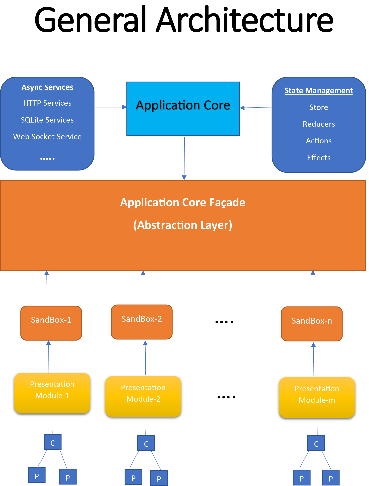

# ANT Angular Architecture with @ngrx

## Modular design

This modular design of this architecture brings among other benefits the testability, maintainability and scalability of the software. Helping developers to better divide the tasks and specializes in the different layers. For angular also helps with the performance through the **change detection strategy**. Angular was designed for the use of design patterns that we will discuss later like **reactive programming, unidirectional data flow and centralized state management**.

Despite what the diagram may indicate every Angular module will divide the application into features containing the necessary elements of all layers. In other words, a specific module will contain its **Presentational Module (Components)**, **Sandboxes and Core Infrastructure (Async Services, Sql Storage, etc)**. This design what allow is a separation of concerns and decoupling the Components from the **Application Core** through the **Abstraction Layer (Sandbox)**.

### Components:

Components are the building blocks of almost every modern front-end framework and **Angular** doesn’t break the rule. To make **Angular** more efficient, organized and in general better designed there is a few guidelines that must be followed for **Components**, but first let’s talk a bit about the two kinds of **Components** from a design point of view.

* **Containers or Smart Components:** Rather I prefer to call them **Container**, **Smart Components** is a name that you should be ready to hear. In simple words they are the components in charge of manage the logic of a feature (calls services, provide data to child components, alter the state of the app, …). When combined with **Centralized State Management** they are also called **Statefull Components**.

* **Presentational Components or Dummy Components:** As with **Container**, I prefer the term **Presentational Component** to describe this category, essentially because it is a very descriptive with its purpose of being. **Presentational Components** oversee the visual part of a feature, in other words they display the user interface and handle the user interactions. Its data is passed by `@Input` variables from the **Container** and communicate with the container using `@Output Events Emitters`. When combined with **Centralized State Management** they are also called **Stateless Components**.

Once presented we can now explain why this categorization is important and how it fits into our design.

The architecture described above is thought to be used with **Centralized State Management, Reactive Programming and Unidirectional Data Flow** design patterns. As you can see the leafs of the three in the architecture diagram receive the name of **Presentational Modules** but this name doesn’t mean that it only contains **Presentational Components**. What this means is that the logic related to **state management** and **async service** calling isn’t in its components but in a **Sandbox** (we’ll talk later about this). Once that said we can describe our **Containers** in this architecture as the place where the communication with the **Sandboxes** occur passing the data to the child **Presentational Components** and reacting to the events trigger inside them. **Presentational Components** keep its behavior as describe above.

The communication process between **Components** described above is just a part of the **Unidirectional Data Flow** pattern implemented in this architecture. **Unidirectional Data Flow** in its simple form means that data goes down and actions go up. Another design note is that single binding is recommended over two-way binding. This design pattern also is important for performance, once applied you can change the **change-detection strategy** of components making your **Angular** project significantly more efficient.

### Sandboxes

The **sandboxes** work as an abstraction of the core functionality of the system. They could be seen as **Application Services** from a **N-Layer architecture** and they main responsibility is to execute the corresponding methods from the **async services** and dispatch the actions to manage the state of the **Store**. **Sandbox** is a service which extends application core facade and exposes streams of state and connections to the async services.

### Ngrx/store

**State management** becomes almost mandatory in apps that tend to grow. In this section let’s talk a bit about **state management** in **Angular** and specifically about `@nrgx/store`.

**State management** comes from the reactive design of **React**, `Facebook` frontend framework and in particular from **Redux**. **Redux** is a module for manage state of an app, but what is state and **state management**??

A **State** is the status of all the sync data of a software in a precise moment in time. When this is usually managed in the **backend** by the database provider in the **client side** it is managed through a **State machine** called **Store**. The **store** is the **centralized storage** of all existing entities data represented by a **state**. To modify the app data an action is dispatched and processed in the **store** by a pure function called **reducer**. A pure function is one that doesn’t have side effects, in other words this means that if you pass always the same input, it will return the same output. This also means that the reducer doesn’t modify the current state, instead it creates a new one.

Above we lightly introduce the key features of **State management**. Let’s do a more formal presentation:

* **Store:** is the **centralized storage management** of the entire app. It contains the **reducers**, maintains the state and exposes the dispatcher. In its `ngrx` version it inherits from the `rxjs` library **BehaviorSubject**.
* **Action:** comes from the message based communication pattern. It has a name and a payload and its dispatched to the **store** in order to change the **state**. Once in the store it is processed by a **reducer** and/or some **effects**
* **Dispatcher:** Is the tool for sending actions to the store. In its `ngrx` version, inherits from **Subject**.
* **Reducer:** Pure function that process an action with a current state and returns a new state reacting to that dispatched action. Each reducer should be focused on a specific section, or slice of state, similar to a table in a database.
* **Effects:** relate to the term side effects. This are used when we need to perform several actions related to a main action. For example, when we emit an action for the creation of an entity an action for call the service must be perform firsts if this failed and action to notify the error will be dispatched and if it success an action to update the state.

#### Components and State:

In **Angular** a way to obtain a considerable performance boost is changing **changeDetection strategy** to `onPush` on components. To do this in a solid way, our app must be design following the **Unidirectional Data Flow** pattern. But how this **Change Detection Strategy** works? Well this means that the component will only detect a change when `@Input` variable value changes, simple right, well no that much the tricky part is this value change detection is done by reference what means that if you change only a field on that object the change detection won’t execute. Now is when **state management** and immutability enter in action. Thanks that the condition of immutability in `ngrx` and **Redux stores** a new reference will always be passed and thanks to that the **change detection strategy** will always work.

## Biblio:
https://gist.github.com/btroncone/a6e4347326749f938510
https://medium.com/netmedia/angular-architecture-patterns-high-level-project-architecture-cb6e3135f716
https://medium.com/netmedia/angular-architecture-patterns-detailed-project-architecture-27bda0334f16
https://medium.com/@anteburazer/angular-architecture-patterns-additional-application-features-ea8093230f0f

